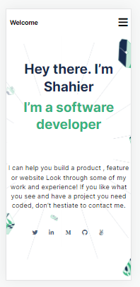

# Portfolio

> Portfolio project to show my skills, my projects and my experience.

## Built With

- HTML
- CSS
- Javascript

## Live Demo

[Live Demo Link](https://shahiernashaat.github.io/Portfolio/)

## Getting Started

To get a local copy up and running follow these simple example steps.

- Click the green Code button on the repo.
- Copy the project url
- In your local PC, open your terminal in the folder you would like to clone the project.
- type "git clone (project-url)"

## Authors

👤 **Shahier Nashaat**

- GitHub: [@githubhandle](https://github.com/ShahierNashaat)
- Twitter: [@twitterhandle](https://twitter.com/ShahierN)
- LinkedIn: [LinkedIn](https://www.linkedin.com/in/shahier-nashaat-73519313a/)

## Show your support

Give a ⭐️ if you like this project!

## Acknowledgments

- Hat tip to anyone whose code was used
- Inspiration
- etc