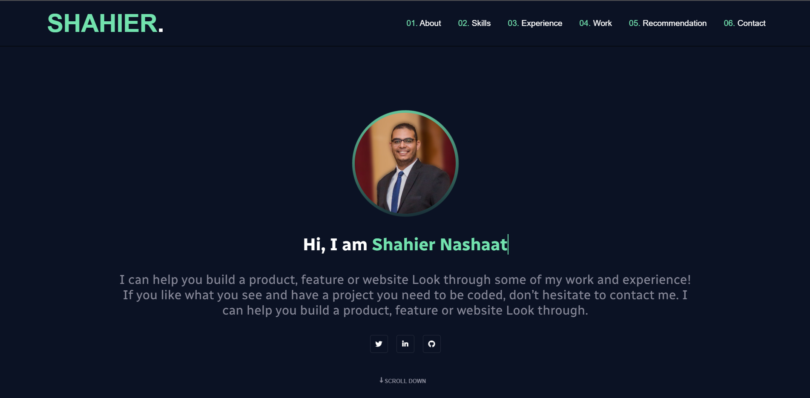

# Portfolio

> Portfolio project to show my skills, my projects and my experience.

## Built With

- HTML5, CSS3, and ES6
- ReactJS

## Live Demo

[Live Demo Link](https://shahiernashaat.me/)

## Getting Started

To get a local copy up and running follow these simple example steps.

- Click the green Code button on the repo.
- Copy the project url
- In your local PC, open your terminal in the folder you would like to clone the project.
- type `git clone https://github.com/ShahierNashaat/Portfolio.git`
- run `npm install` and then `npm start`

## Authors

👤 **Shahier Nashaat**

- GitHub: [ShahierNashaat](https://github.com/ShahierNashaat)
- Twitter: [@ShahierN](https://twitter.com/ShahierN)
- LinkedIn: [shahier-nashaat](https://www.linkedin.com/in/shahier-nashaat/)

## Show your support

Give a ⭐️ if you like this project!

## Acknowledgments

- Hat tip to anyone whose code was used
- Inspiration
- etc